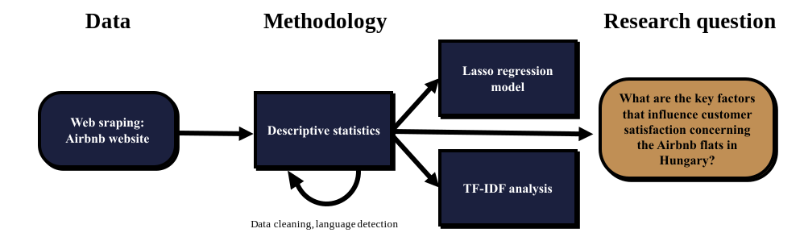

# Introduction {#Chapter-1}

```{css, echo=FALSE}
p {
  text-align: justify;
}
```

The phenomenon of collaborative consumption including peer-to-peer (P2P) accommodations has gained great popularity over the past decade. To understand what P2P accommodation means, we first define sharing or collaborative economy (the term ‘collaborative economy’ is interchangeably used with the term ‘sharing economy’). The term 'collaborative economy’ – as the Commission refers to it – “is business models where activities are facilitated by online platforms that create an open market place for the temporary user of goods or services often provided by private individuals” (COM, 2016, 356 final, page 3). Peer-to-peer accommodation occurs when two individuals (service providers and the users of these services) transact business without an intermediary third party. 

Several factors drive the use of shared accommodations. Sharing of personal properties provides an opportunity for owners to (1) *lower* the *transaction costs* of operating short-term rentals (and this allows travelers to consider destinations and tourism activities that are otherwise of a prohibitive cost (Tussyadiah & Pesonen, 2015)). Online rental marketplaces (2) establish a *direct connection between people* who want to rent out their dwellings with the ones looking for accommodations. The (3) *availability of traditional experiences* – allowing travelers to “live like a local” – also has an impact on consumer decisions (Bridges & Vásquez, 2016). Another significant factor is (4) *social acceptance*: “sharing economies, ones such as accommodations, are a more sustainable alternative to traditional travel lodging through the consumption of less energy and resources, the production of less waste, and the overall theme of sustainability that is portrayed through many hosts and users of the service” (Midgett et al., 2018).  Further key drivers explaining the growth in the use of Airbnb are “positive word of mouth”, “digital infrastructure and literacy of the population” and “vocal support from the government” (PwC, 2016).

As a result of the factors mentioned above, house and flat sharing platforms like Airbnb now rival some of the world’s largest businesses in hospitality. Since the founding of Airbnb in 2008, more than 800 million^[ https://news.airbnb.com/about-us/] guests have checked in at Airbnb listings around the world – and the number of guest arrivals is still growing rapidly.

Figure 1 presents the proportion of online bookings of the main types of tourist accommodation by country and partner type. Approximately 25 percent of partners – domestic and outbound together – book accommodation online in Hungary. This supports our expectation that there is a significant number of Airbnb users in the country. “A related study by PwC shows that while in 2013 the sharing economy companies […] where the new business model is the most prevalent earned sales revenue of 15 billion dollars, by 2025 this will have risen to 335 billion dollars, so half of the revenues in these markets will go to companies with a sharing-based model” (PwC, 2015).


```{r eurostat, fig.cap='Proportion of internet bookings of the main means of accommodation by countries and the partner type', fig.height=5}
# Introduction --------------------------------------------------------------------------

f.plot_eurostat <- function(x){
  eurostat::get_eurostat('tour_dem_ttorg', time_format = 'num') %>% 
    filter(trip_arr %in% c('ACC_WEB', 'TOTAL') & duration == 'N1-3' & time == 2017 & 
             purpose == 'TOTAL') %>% 
    pivot_wider(names_from = trip_arr, values_from = values) %>% 
    mutate(
      value = ACC_WEB/TOTAL
    ) %>% 
    filter(partner == x) %>% 
    mutate(geo = fct_reorder(geo, -value)) %>% 
    ggplot() +
    aes(geo, value, fill = geo == 'HU') +
    geom_hline(yintercept = 0) +
    geom_col(color = 'black') +
    scale_fill_brewer(palette = 3, guide = F) +
    scale_y_continuous(labels = scales::percent, limits = c(0, .7)) +
    labs(
      x = NULL, y = NULL, title = case_when(
        x == 'DOM' ~ 'Domestic',
        x == 'OUT' ~ 'Outbound',
        T ~ 'Total'
      )
    )
}

ggpubr::ggarrange(
  f.plot_eurostat('DOM'),
  f.plot_eurostat('OUT'),
  f.plot_eurostat('WORLD') +
    labs(caption = 'Source of data: Eurostat'),
  ncol = 1
)

```


The main objective of this study is *to determine the perceived behavior of individuals choosing Airbnb accommodations through the analysis of online reviews and investigate the attributes that influence user ratings and reviews on the aforementioned collaborative platform*. In this paper, we examine the entire territory of Hungary.

Accordingly, our research question is the following: *What are the key factors that influence customer satisfaction concerning the Airbnb flats in Hungary?* To give a detailed answer, we analyzed online review comments gained from the Hungarian Airbnb website by using web scraping techniques. Big data analytics with over 75,000 observations (customer feedbacks) enabled us to better understand customer preferences, behavior and sentiment. Machine learning analysis was performed to extract all the above-mentioned information. We used two main text analysis tools: TF-IDF (term frequency-inverse document frequency) analysis – which was also supported by the closely related literature (Barbosa, 2019; Cheng, 2019; Zhang & Fu, 2020) – and the lasso regression model. By using these tools, *Cheng* (2019) identified that customers’ experience with Airbnb and traditional hotels have some points in common, and as a result, users often evaluate their experience with Airbnb stays based on their experience with traditional hotels. The author detected three factors (‘location’, ‘amenities’ and ‘host’) that contribute significantly to customer satisfaction. Contrary to expectations, ‘price’ was not statistically significant when investigating its impact on user ratings, which confirms our findings. *Cheng* also found that Airbnb users tend to use the names of the hosts in their reviews, which led the author to the conclusion that a higher degree of intimacy between hosts and costumers can be observed – we came to the same conclusion. According to *Zervas* (2015, p. 12), there is empirical evidence that user ratings on the Airbnb platform are „dramatically high”. Our results also support this statement: we found that 60 percent of the observations (properties) have a user rating of 4.75 or above. 

```{r fig.cap="Main steps of the study"}

```


Since the phenomenon of Airbnb is quite new, only a small amount of research has been done about the preferences and motivation of its users. This study contributes to a broader understanding of the experiences and preferences of Airbnb users in Hungary, while extends the scientific discourse in many directions by exploring research gaps. Methodologically, it contributes to the existing literature by providing an accurate and up-to-date database (created by using web scraping techniques in R software), which contains data about Airbnb users all over Hungary. The database is available in a public GitHub repository^[ https://github.com/MarcellGranat/airbnb-research].  
